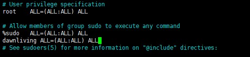

# kubernetes-guide #
## Scope of application ##
Mostly this guidance is for the user who **don't have any experience** in kubernetes deployment on debian(linux) system 
## Environment ## 
Debian 12.4 (updated to latest at 2023/12/20)
## Content ##
If you are a experienced linux user , can skip to step .
### Background ###
There is one thing have to discuss with, In Debian 12.4 the text editor -- nano is easy to use for the **beginners**.(Just a recommend)
It is also allowed to use other text editor like -- vi/vim.
### Step 1 obtain the sys access authority ###
After start the Debian System you will see the image as below.

#### Alternative ####
    su -
The system will ask you for the root password.
##### For Learning Environment #####
Skip to next step
##### For Poduction Environment  #####
    nano /etc/sudoers

Locate at the line as below:

    # Allow members of group sudo to execute any command
    %sudo   ALL=(ALL:ALL) ALL

Then add your system account below to obtain the system access authority.
(**This is based on your production environment system-access structure**. )

Here offers the full-access to the example account.

`dawnliving ALL=(ALL:ALL) ALL`

(For the `nano` text editor press `Ctrl+O` and `Enter` to save the change to the file and press `Ctrl+X` to exit)

(For the `vi/vim` usually to press `:` ,  then input `wq` then press `Enter` to save and exit)
### Step 2 Edit the Package Repository ###
To be continued