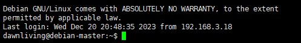
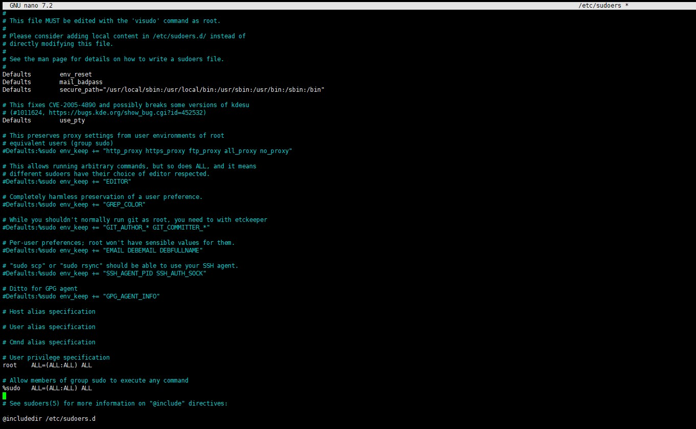
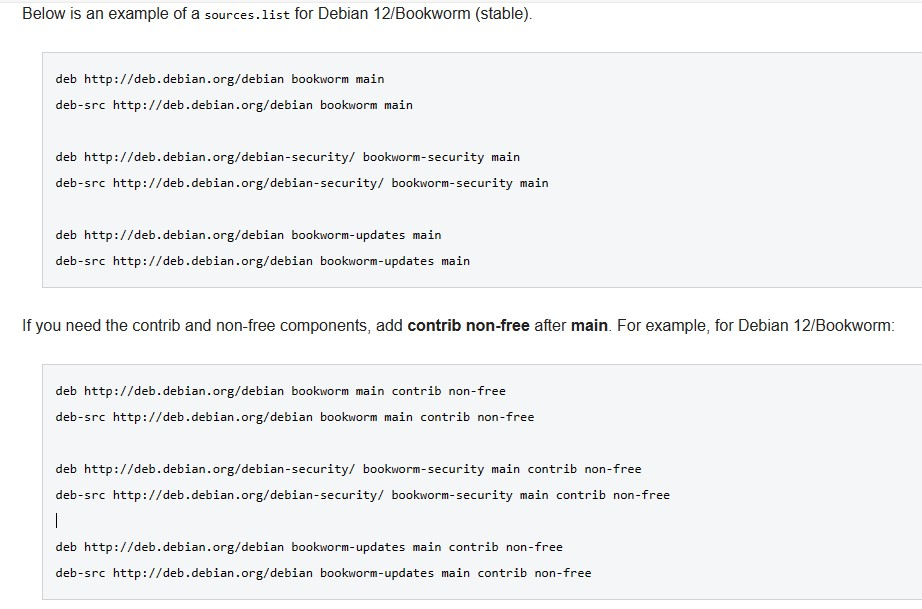
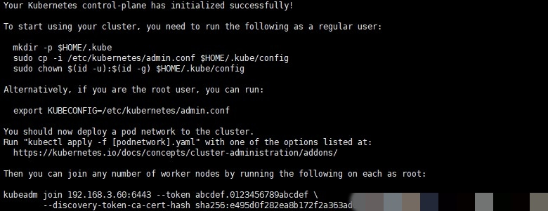
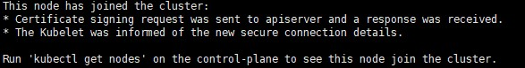
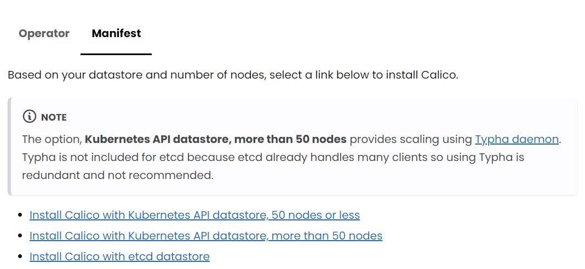
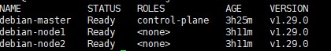

# kubernetes-guide #

## Scope of application ##

Mostly this guidance is for the user who **don't have any experience** in kubernetes deployment on debian(linux) system 
## Environment ## 

Debian 12.4 (up-to-date to at 2023/12/20)
containerd
Kubernetes v1.29.0 (up-to-date at 2023/12/21)

## Content ##

If you are a experienced linux user , can skip to step .

### Background ###

There is one thing have to discuss with, In Debian 12.4 the text editor -- nano is easy to use for the **beginners**.(Just a recommend)
It is also allowed to use other text editor like -- vi/vim.

### Step 1 obtain the sys access authority ###

After start the Debian System you will see the image as below.

#### Alternative ####
    su -
The system will ask you for the root password.

##### For Learning Environment #####

Skip to next step

##### For Poduction Environment  #####

    nano /etc/sudoers

Locate at the line as below:

    # Allow members of group sudo to execute any command
	%sudo   ALL=(ALL:ALL) ALL

Then add your system account below to obtain the system access authority.
(**This is based on your production environment system-access structure**. )

Here offers the full-access to the example account.

	dawnliving ALL=(ALL:ALL) ALL

(For the `nano` text editor press `Ctrl+O` and `Enter` to save the change to the file and press `Ctrl+X` to exit)

(For the `vi/vim` usually to press `:` ,  then input `wq` then press `Enter` to save and exit)

### Step 2 Edit the Package Repository ###

This step mainly talked about how to edit apt repository. There have a lot of ways to install required apps and kubernetes. But in this guidance, all the required apps and kubernetes(k8s) will be installed by **apt** package control tool(**Debian/Ubuntu**, in Centos uses yum).

	nano /etc/apt/source.list

Then visit the website(Here offer the official repository example)

[https://wiki.debian.org/SourcesList](https://wiki.debian.org/SourcesList)

In this website, need to find the example that official offers, then find the exact version of the operating system.
(This guide will choose Debian 12(Bookworm).)

The example as below:

	deb http://deb.debian.org/debian bookworm main contrib non-free-firmware
	deb-src http://deb.debian.org/debian bookworm main contrib non-free-firmware

	deb http://deb.debian.org/debian-security/ bookworm-security main contrib non-free-firmware
	deb-src http://deb.debian.org/debian-security/ bookworm-security main contrib non-free-firmware
	
	deb http://deb.debian.org/debian bookworm-updates main contrib non-free-firmware
	deb-src http://deb.debian.org/debian bookworm-updates main contrib non-free-firmware

Then paste one example(based on your requirement) to `source.list` save and exit.

### Step 3 Proxy Setting (If needed) ###

**Notice**: 

1. If your environment need to connect the Internet by Proxy. The guidance as below.
2. This step is **not necessary** for all users. If needed, continue reading. If not, skip to next step.

The root system access authority is needed. If the user log in is not root, the `sudo` is needed to attach to the front of all the following commands.

	systemctl set-environment http_proxy=your-example:port

	systemctl set-environment https_proxy=your-example:port

	systemctl set-environment no_proxy=localhost,127.0.0.0/8,192.168.0.0/16,10.0.0.0/8,172.16.0.0/12

Setting as above will let the system all the Internet connection through the proxy setting except the `no_proxy` declaration. If you don't want other service that don't mention in the guidance connect to the Internet through the proxy, modify the `no_proxy` setting, in case lead to other service connection refused error.

### Step 4 Container Runtimes Installation ###

Before Installing kubernetes, must do some preparation.

Forwarding IPv4 and letting iptables see bridged traffic.

	cat <<EOF | sudo tee /etc/modules-load.d/k8s.conf
	overlay
	br_netfilter
	EOF
	
	sudo modprobe overlay
	sudo modprobe br_netfilter
	
	# sysctl params required by setup, params persist across reboots
	cat <<EOF | sudo tee /etc/sysctl.d/k8s.conf
	net.bridge.bridge-nf-call-iptables  = 1
	net.bridge.bridge-nf-call-ip6tables = 1
	net.ipv4.ip_forward                 = 1
	EOF
	
	# Apply sysctl params without reboot
	sudo sysctl --system

Verify that the br_netfilter, overlay modules are loaded by running the following commands:

	lsmod | grep br_netfilter
	lsmod | grep overlay

Verify that the net.bridge.bridge-nf-call-iptables, net.bridge.bridge-nf-call-ip6tables, and net.ipv4.ip_forward system variables are set to 1 in your sysctl config by running the following command:

	sysctl net.bridge.bridge-nf-call-iptables net.bridge.bridge-nf-call-ip6tables net.ipv4.ip_forward

And kubernetes doesn's support swap, need to turn it off.

	swapoff -a

According to the most usage of container, This guide will choose the **containerd** as the Container Runtimes.

###If not root authority , all the command need to add **sudo**(including the pipe operator).###

Set up Docker's apt repository.

	#Add Docker's official GPG key:
	
	apt-get update
	
	apt-get install ca-certificates curl gnupg
	
	install -m 0755 -d /etc/apt/keyrings
	
	curl -fsSL https://download.docker.com/linux/debian/gpg | gpg --dearmor -o /etc/apt/keyrings/docker.gpg
	
	chmod a+r /etc/apt/keyrings/docker.gpg
	
	#Add the repository to Apt sources:
	
	echo \
	"deb [arch=$(dpkg --print-architecture) signed-by=/etc/apt/keyrings/docker.gpg] https://download.docker.com/linux/debian \
	$(. /etc/os-release && echo "$VERSION_CODENAME") stable" | \
	tee /etc/apt/sources.list.d/docker.list > /dev/null
	
	apt-get update

	    
Notice:

- **$VERSION_CODENAME** -- Here needed to replace by **bookworm**. (Based on the version of system.)
- `\` The operator is resembles with `\n` -- newline character. 

Will get such result as below.

Install the Docker packages.

	apt-get install docker-ce docker-ce-cli containerd.io docker-buildx-plugin docker-compose-plugin

Create a containerd configuration file.

    containerd config default | sudo tee /etc/containerd/config.toml

Configuring the systemd cgroup driver.

	nano /etc/containerd/config.toml

set like below:

	[plugins."io.containerd.grpc.v1.cri".containerd.runtimes.runc]
	  ...
	  [plugins."io.containerd.grpc.v1.cri".containerd.runtimes.runc.options]
	    SystemdCgroup = true

And:

	[plugins."io.containerd.grpc.v1.cri"]
	  sandbox_image = "registry.k8s.io/pause:3.2"

Then:

	systemctl restart containerd

If proxy is needed:

	systemctl enable docker
	systemctl enable containerd
	
	mkdir /etc/systemd/system/docker.service.d
	mkdir /etc/systemd/system/containerd.service.d

	nano /etc/systemd/system/docker.service.d/http-proxy.conf
	nano /etc/systemd/system/containerd.service.d/http-proxy.conf

Paste the content to both of the files as below, then save and exit:

	[Service]
	Environment="HTTP_PROXY=http://example.com:port" "HTTPS_PROXY=http://example.com:port" "NO_PROXY=localhost,127.0.0.0/8,192.168.0.0/16,10.0.0.0/8,172.16.0.0/12,*.local,local.*,docker-registry.example.com,.corp"
	#Have to replace the http://example.com:port with your proxy server.	

### Step 5 Install kubernetes ###

These instructions are for Kubernetes 1.29.

	sudo apt-get update
	# apt-transport-https may be a dummy package; if so, you can skip that package
	sudo apt-get install -y apt-transport-https ca-certificates curl gpg

	curl -fsSL https://pkgs.k8s.io/core:/stable:/v1.29/deb/Release.key | sudo gpg --dearmor -o /etc/apt/keyrings/kubernetes-apt-keyring.gpg

	# This overwrites any existing configuration in /etc/apt/sources.list.d/kubernetes.list
	echo 'deb [signed-by=/etc/apt/keyrings/kubernetes-apt-keyring.gpg] https://pkgs.k8s.io/core:/stable:/v1.29/deb/ /' | sudo tee /etc/apt/sources.list.d/kubernetes.list

	#install kubelet,kubeadm and kubectl, and pin the version.
	sudo apt-get update
	sudo apt-get install -y kubelet kubeadm kubectl
	sudo apt-mark hold kubelet kubeadm kubectl

### Notice ### 

The above steps needed to be apply for all the machines(including the master node(s) and the slave node(s)).

From this line begin, without specify, always needed to be done only on master node.

[Reference](https://kubernetes.io/docs/tasks/administer-cluster/kubeadm/configure-cgroup-driver/)

Configuring a cgroup driver.
	
	nano kubeadm-config.yaml

Then paste the following content, save and exit.

	# kubeadm-config.yaml
	kind: ClusterConfiguration
	apiVersion: kubeadm.k8s.io/v1beta3
	kubernetesVersion: v1.29.0
	---
	kind: KubeletConfiguration
	apiVersion: kubelet.config.k8s.io/v1beta1
	cgroupDriver: systemd

> Explanation:
> If at the moment, want to add more configuration, just follow as below instead:
> `kubeadm config print init-defaults > kubeadm-config.yaml`
> change the advertiseAddress and add the cgroupDriver at least.
> find the line like this:
> `advertiseAddress: 1.2.3.4`
> and replace the ip address based on your own Environment.
> then add the below content in the end.
> 
    ---
    kind: KubeletConfiguration
    apiVersion: kubelet.config.k8s.io/v1beta1
    cgroupDriver: systemd
> save and exit.
    

Then pull the images from the server.

	#(Proxy if needed）
	export http_proxy=http://example_ip:port
	export https_proxy=http://example_ip:port
	------------------------------------------
	

	kubeadm config images list
	kubeadm config images pull

Modify the hostname so that kubernetes can access into nodes by hostname.（**all nodes needed to be done**）

	nano /etc/hosts

Based on your IP Address and hostname of you system.

Example Input

	192.168.3.60    debian-master
	192.168.3.61    debian-node1
	192.168.3.62    debian-node2

Save and Exit. Synchronize the setting.

	sysctl --system 

Before Initialization, need to Configure the Container Runtimes Interface.

	nano /etc/crictl.yaml

Then modify the line
	
	runtime-endpoint: ""

like this:

	runtime-endpoint:"unix:///run/containerd/containerd.sock"

Then save the file and exit.

Finish the initialization.

	kubeadm init --config kubeadm-config.yaml

Get the result like this:

Complete the end step:

	mkdir -p $HOME/.kube
	sudo cp -i /etc/kubernetes/admin.conf $HOME/.kube/config
	sudo chown $(id -u):$(id -g) $HOME/.kube/config	

	nano ~/.bashrc
	# paste the content, then save and exit
	export /etc/kubernetes/admin.conf
	
	source ~/.bashrc

Then Congratulation, then master node of kubernetes installation is accomplished!

### Step 6 Join the nodes ###

At the master node, can get the join token when the initialization accomplished, go through the end of Step 5. 
You can find the token at **the master node** as well use command:

	kubeadm token create --print-join-command

Then at the slave nodes join the clusters.

	kubeadm join your-ip:port --token example-token(**needed to replace**) --discovery-token-ca-cert-hash sha256:example-sha256-hash(**needed to replace**)

 
The result:

### Step 7 Install a Pod network add-on ###

[Reference1](https://kubernetes.io/docs/setup/production-environment/tools/kubeadm/create-cluster-kubeadm/#pod-network)
[Reference2](https://github.com/containernetworking/cni?tab=readme-ov-file#3rd-party-plugins)

Choose one of pod network add-on, here will choose Calico as example.

[Reference3](https://docs.tigera.io/calico/latest/getting-started/kubernetes/self-managed-onprem/onpremises#install-calico)

Choose the compatible version for your own environment. Here will choose the 50 nodes or less.

	kubectl apply -f https://raw.githubusercontent.com/projectcalico/calico/v3.27.0/manifests/calico.yaml

Then complete the configuration:

	mkdir -p $HOME/.kube
	sudo cp -i /etc/kubernetes/kubelet.conf $HOME/.kube/config
	sudo chown $(id -u):$(id -g) $HOME/.kube/config	

	nano ~/.bashrc
	# paste the content, then save and exit
	export /etc/kubernetes/admin.conf
	
	source ~/.bashrc

Watch the processes when all of them is running.

	watch kubectl get pod -n kube-system

### In the end ###

Check the status of your nodes

	kubectl get nodes

Get the results as below. Then **Congratulation**! All the kubernetes clusters are installed successfully! All the steps are completed!

